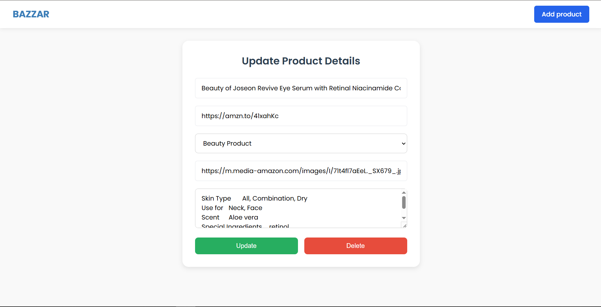
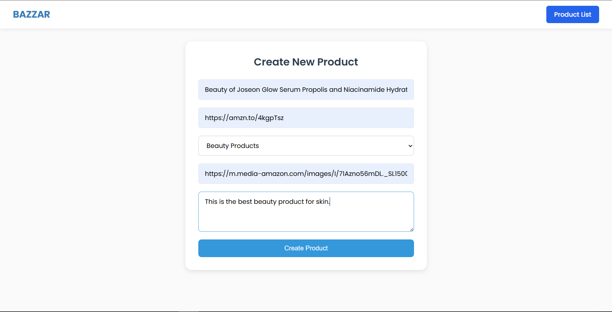
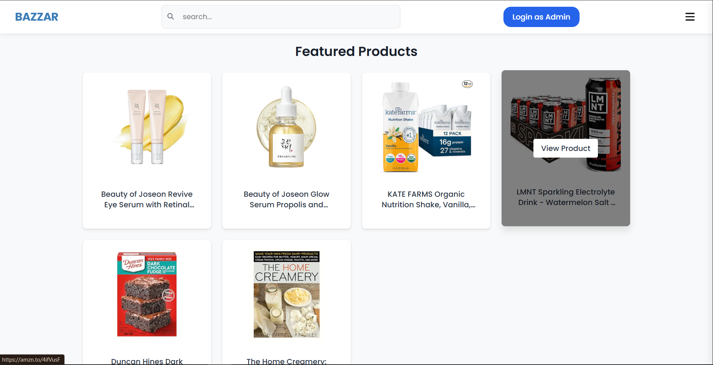
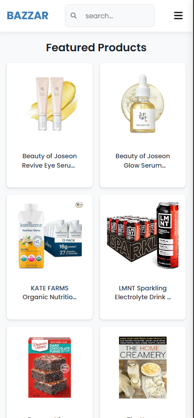
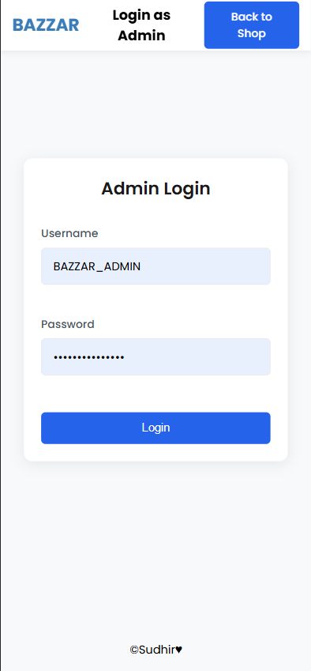
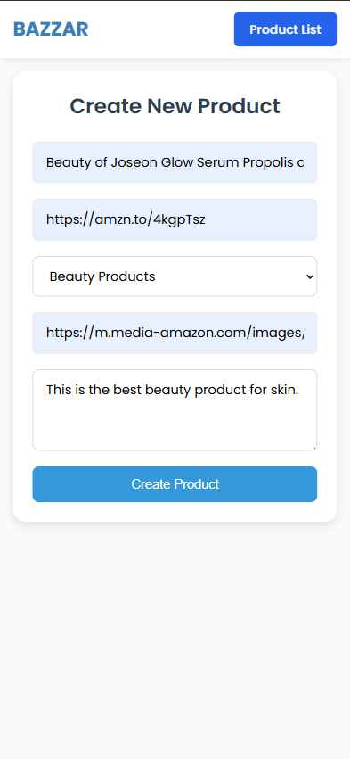
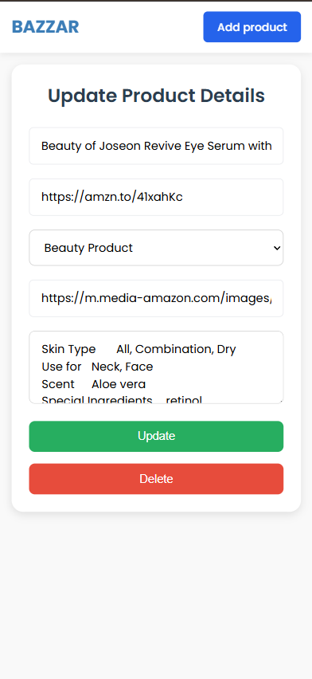

# 🛍️ BAZZAR — E-commerce Admin Dashboard & Product Showcase


BAZZAR is a sleek, responsive web application designed for managing and showcasing affiliate products. It allows users to browse a curated selection of items and seamlessly navigate to external platforms like Amazon or Flipkart via dedicated product links — all from within the BAZZAR interface.


This fronted app works together with a Node.js + express backend.


You can find the backend source code here:
[affiliate-server (Backend Repo)](https://github.com/Sudhir302/affiliate_server.git)

## 🚀 Features
    - Responsive UI for desktop and mobile
    - Product search with real-time filtering
    - Category-based product listing
    - Admin panel for editing, updating, and deleting products
    - Backend-connected using **Axios** with cookies
    - Admin login with protected routes

## Screenshots

<p >
    
    
    
    
    <br />
    
    
    
    
</p>

## Tech Stack
### Frontend:
- React.js
- Axios
- CSS3
- Vite

### Backend (Expected):
- Node.js / Express.js
- MongoDB (Mongoose)
- JWT & Cookie-based Authentication

## 🚀 Getting Started

### Prerequisites
- node
- VS Code
- [affiliate-server (Backend Repo)](https://github.com/Sudhir302/affiliate_server.git)


### Installation

1. Clone the repository
    ```
    https://github.com/Sudhir302/affiliate_client.git

2. Navigate to the project directory
    ```
    cd affiliate_client

3. Install dependencies:
    ```
    npm install

4. Run the app
    ```
    npm run dev

## 📂 Folder Structure (Frontend)

src/
├── components/
|   ├── ComNav.jsx
|   ├── Footer.jsx
|   ├── Googlelogin.jsx
│   ├── Navbar.jsx
│   ├── Sameproduct.jsx
├── pages/
│   ├── CreateProduct.jsx
│   ├── EditProduct.jsx
│   ├── Login.jsx
|   ├── PageNotFound.jsx
│   ├── Productlist.jsx
│   ├── Products.jsx
├── styles/
|   ├── CompNav.css
│   ├── CreateProduct.css
│   ├── EditProduct.css
│   ├── Login.css
│   ├── Navbar.css
│   ├── Productlist.css
│   ├── Products.css
├──utils
|    ├── Protected.jsx
|


## 📄 License

This project is licensed under the MIT LICENSE - see the [MIT License](./LICENSE) for details.
## Contact
Sudhir Chaudhary - csudhir302@gmail.com